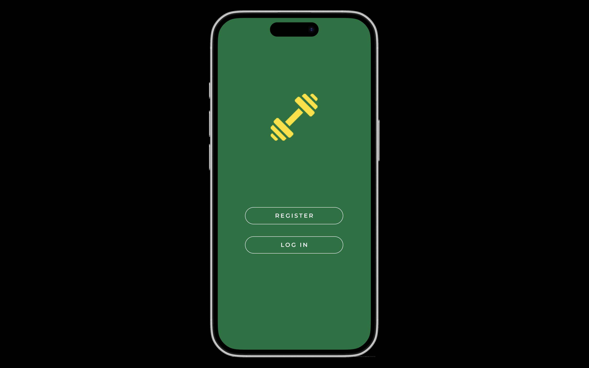
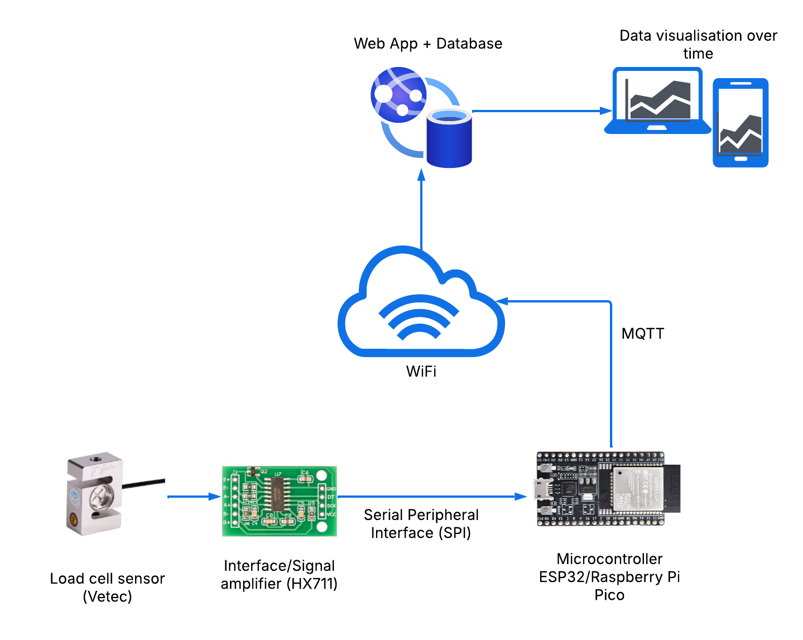

# IMTP Strength Measurement Mobile App

A comprehensive mobile application for measuring strength using the Isometric Mid-thigh Pull (IMTP) exercise. This project combines hardware sensors, microcontroller firmware, and a Flutter mobile application to capture, process, store, and visualize strength data.

## Project Overview

This project focuses on developing a mobile app for measuring strength using the Isometric Mid-thigh Pull (IMTP) exercise. A load cell sensor is used to capture the force exerted during the pull. This data is then processed by a microcontroller, transmitted wirelessly, stored securely in a database, and finally accessed and visualized by users through the mobile application.

## Application Home Page



## Test Selection Feature

The application now includes a test selection screen that allows users to choose between different test types:

- **IMTP**: Isometric Mid-thigh Pull test
- **Iso squat**: Isometric Squat test
- **Bench press**: Bench Press test
- **Custom**: Custom configured tests

This feature enables trainers and athletes to run specific tests tailored to their training needs. The test results are displayed in real-time through the IoT dashboard.

### Feature Demo


## Key Features

- **Real-time IoT Data Monitoring**: View sensor data from connected devices in real-time
- **Historical Data Analysis**: Visualize performance trends over time
- **User Authentication**: Secure login and account management
- **Administrative Tools**: User management interface for coaches/administrators
- **MQTT Integration**: Reliable communication protocol for IoT devices
- **Wireless Communication (WiFi)**: The microcontroller transmits the processed data to the mobile app.
- **Multiple Test Types**: Support for various strength tests including IMTP, Iso squat, and Bench press

## System Components

### Hardware Development

- **Load Cell Sensor (Vetec)**: Primary component for measuring the force applied during the IMTP.
- **Interface/Signal Amplifier (HX711)**: Interfaces with the load cell and amplifies its output signal, making it suitable for the microcontroller to read.
- **Microcontroller (ESP32)**: Central processing unit that receives the amplified signal, pre-processes the data, and handles wireless communication.
- **Serial Peripheral Interface (SPI)**: Communication protocol used for data transfer between the amplifier and the microcontroller.

Below is a basic diagram illustrating the load cell setup:



### Firmware Development

- **Load Cell Data Acquisition**: Programming the microcontroller to read data from the amplifier via SPI.
- **Data Pre-processing**: Implementing algorithms to process the raw load cell data (filtering, calibration).
- **Wireless Communication Implementation**: Developing firmware to establish a wireless connection and transmit data using MQTT.

### Server (Backend) Development

- **Database Management**: Securely storing strength data received from the microcontroller.
- **API Development**: Creating interfaces that allow the mobile application to access the data.
- **MQTT Broker**: Handling the incoming data stream from microcontrollers, especially if scaling to multiple users or devices.

### Mobile App Development

- **User Interface (UI) Design**: Creating an intuitive and user-friendly interface.
- **Data Visualization**: Implementing features to visualize strength data over time (graphs, charts).
- **User Authentication and Authorization**: Secure user accounts and login systems.
- **Data Retrieval and Display**: Fetching data from backend APIs and displaying it to users.

## IoT Integration

The app uses MQTT (Message Queuing Telemetry Transport) protocol for communicating with IoT devices. This lightweight protocol is ideal for constrained devices and low-bandwidth, high-latency networks, making it perfect for IoT applications.

### IoT Dashboard

The IoT Dashboard screen provides:
- Real-time temperature and humidity readings
- Historical data visualized through charts
- Connection status monitoring
- Device information display

The dashboard connects to an MQTT broker to receive sensor data. For demonstration purposes (as seen in the `temp-humidity-sensor` branch), it can subscribe to a topic like `data/1dv027` for temperature and humidity. In the future, this will be adapted to subscribe to the relevant MQTT topics for real-time IMTP sensor data.

## Project Structure

```
lib/
  ├── components/     # Reusable UI components/widgets (buttons, text fields, etc.)
  │   ├── auth_card.dart
  │   ├── back_button.dart
  │   ├── custom_text_field.dart
  │   ├── primary_button.dart
  │   └── profile_icon.dart
  │
  ├── models/         # Data models
  │   └── user.dart   # User model for authentication and user management
  │
  ├── screens/        # UI screens
  │   ├── auth/       # Authentication screens
  │   │   ├── login_screen.dart
  │   │   └── register_screen.dart
  │   ├── admin/      # Admin screens
  │   │   ├── admin_dashboard.dart
  │   │   ├── add_user_screen.dart
  │   │   └── user_list_screen.dart
  │   ├── iot_dashboard.dart  # IoT device monitoring and data visualization
  │   └── auth_screen.dart
  │
  ├── services/       # Business logic and data services
  │   ├── mqtt_service.dart  # MQTT client for IoT communication
  │   └── users_data.dart    # User management service
  │
  ├── theme/          # App theming/Styling definitions (colors, text styles)
  │   ├── colors.dart
  │   └── text_styles.dart
  │
  └── main.dart       # App entry point, defines routes and theme
```

## Getting Started

### Prerequisites

- Flutter SDK (version 3.0.0 or higher)
- Dart SDK (version 2.17.0 or higher)
- Android Studio or Xcode for mobile device emulation/testing
- Physical Android or iOS device for testing
- ESP32 microcontroller (for hardware integration)

### Connecting a Physical Device

There are two options for connecting your device for development:

1. **Wireless Connection (WiFi)** - Allows for cable-free development
2. **Wired Connection (USB)** - Traditional, reliable connection method

Choose the method that best suits your needs.

#### Option 1: Wireless Debugging (WiFi)

For a cable-free development experience:

1. First, connect your device via USB cable (required only for initial setup)
   
2. Enable Developer options and USB debugging as described in the Android section below
   
3. **Make sure your computer and phone are connected to the same WiFi network**
   
4. Put your Android device in TCP/IP mode:
   ```
   adb tcpip 5555
   ```
   
5. Get your device's IP address:
   ```
   adb shell ip addr show wlan0 | grep "inet " | cut -d' ' -f6 | cut -d'/' -f1
   ```
   This will display an IP address like `192.168.1.138`
   
6. Connect to your device wirelessly:
   ```
   adb connect YOUR_DEVICE_IP:5555
   ```
   For example: `adb connect 192.168.1.138:5555`
   
7. Verify the connection:
   ```
   adb devices
   ```
   You should see your device listed with its IP address
   
8. Disconnect the USB cable and run your app:
   ```
   flutter run
   ```

**Important Notes:**
- Your computer and phone **must** be on the same WiFi network for this to work
- Different WiFi networks will not work, as they typically have separate subnets and firewalls
- If you restart your development session, simply run `flutter run` again
- If the IP address changes (different WiFi, router reboot, etc.), repeat steps 1-7
- Bluetooth is not supported for Flutter debugging, only WiFi

#### Option 2: Android Devices (USB Connection)

1. Enable Developer options on your device:
   - Go to **Settings** > **About phone** (location may vary by manufacturer)
   - Tap **Build number** 7 times until you see "You are now a developer!"

2. Enable USB debugging:
   - Go to **Settings** > **Developer options** (may be under Additional Settings on some devices)
   - Turn on **USB debugging**
   - On some devices, you may need to enable **Install via USB** option
   - Some manufacturer UIs (like MIUI on Xiaomi) may require disabling UI optimizations for development

3. Connect your device via USB cable to your computer

4. If prompted on your device, allow USB debugging

5. For devices that show installation errors like "INSTALL_FAILED_USER_RESTRICTED":
   - Check your device's permission settings
   - Look for **Install via USB** options in **Settings** > **Apps** > **Permissions**
   - Different manufacturers place these settings in various locations
   - Check manufacturer-specific documentation if needed

#### iOS Devices

1. Connect your iOS device to your Mac
2. Open Xcode and navigate to Window > Devices and Simulators
3. Select your device and make sure it's recognized
4. In your Flutter project, ensure you have a valid iOS Developer account set up in Xcode

### Running the App

1. Navigate to the project directory
   ```
   cd idrott_app
   ```

2. Clean the project (recommended when switching branches or when facing build issues)
   ```
   flutter clean
   ```

3. Get dependencies
   ```
   flutter pub get
   ```

4. Find connected devices
   ```
   flutter devices
   ```
   This will show a list of connected devices with their IDs, for example:
   ```
   Pixel 6 (mobile)               • a1b2c3d4              • android-arm64 • Android 12 (API 31)
   Samsung Galaxy S22 (mobile)    • ef5678gh              • android-arm64 • Android 12 (API 31)
   iPhone 13 Pro (mobile)         • 00001111-AAAA2222     • ios           • iOS 15.5
   macOS (desktop)                • macos                 • darwin-arm64  • macOS 12.4
   ```

5. Run the app on a connected device by ID 
   ```
   flutter run -d <device_id>
   ```
   For example:
   ```
   flutter run -d a1b2c3d4    (Pixel 6 (mobile))
   ```

6. Or simply run on the default connected device
   ```
   flutter run
   ```

### Troubleshooting Device Connection

If your device is not showing up when running `flutter devices`:

1. Ensure USB debugging is enabled
2. Try disconnecting and reconnecting the USB cable
3. Try a different USB cable or port
4. Run `flutter doctor` to diagnose issues
5. For Android, install appropriate USB drivers for your device
6. Restart both your computer and device

### Setting Up a Development Environment in Cursor

1. Open the project in Cursor
2. Use the integrated terminal to run Flutter commands
3. Edit code in Cursor's editor
4. Debug and run the application directly from Cursor
5. No need for Android Studio for Flutter development

## Mobile-Specific Considerations

- **Local Storage**: Mobile-optimized data storage for offline functionality
- **Mobile UI/UX**: Interface designed specifically for handheld touch devices
- **Native Look and Feel**: Following Material Design (Android) and Cupertino (iOS) design guidelines

## Development Roadmap

- [ ] Complete hardware integration with ESP32 and load cell
- [ ] Implement MQTT communication between hardware and mobile app
- [ ] Develop data visualization features
- [ ] Implement user authentication and profiles
- [ ] Add data export functionality
- [ ] Create administrative features for managing multiple users
- [ ] Implement real-time data streaming

## Resources

For help getting started with Flutter development, view the
[online documentation](https://docs.flutter.dev/), which offers tutorials,
samples, guidance on mobile development, and a full API reference.

For ESP32 development, refer to [ESP32 documentation](https://docs.espressif.com/projects/esp-idf/en/latest/).

**!! Important Notes:**
- Your computer and phone **must** be on the same WiFi network for this to work.
- Different WiFi networks will not work, as they typically have separate subnets and firewalls.
- **Re-establishing Connection**: You will need to connect your device via USB and repeat steps 1-8 if:
    - You start a new development session.
    - Your device's IP address changes (e.g., due to connecting to a new WiFi network or a router reboot).
    - Your device or computer restarts.
    - The ADB server restarts.
- Once the wireless connection is active, you can disconnect the USB cable. If the connection remains stable (same WiFi, no restarts), you can simply use `flutter run` for subsequent builds in the same session.
- If you restart your development session, simply run `flutter run` again
- If the IP address changes (different WiFi, router reboot, etc.), repeat steps 1-7
- Bluetooth is not supported for Flutter debugging; this setup uses WiFi only.

#### Option 2: Android Devices (USB Connection)
